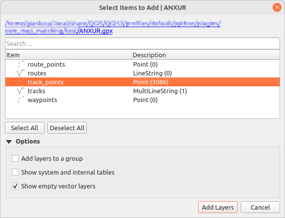
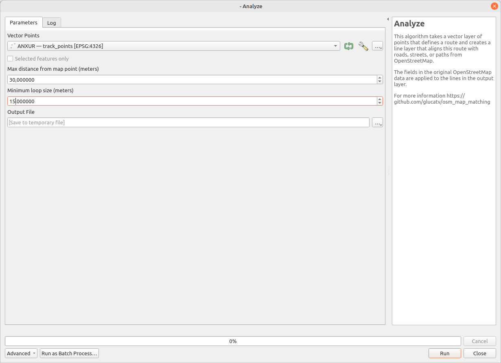
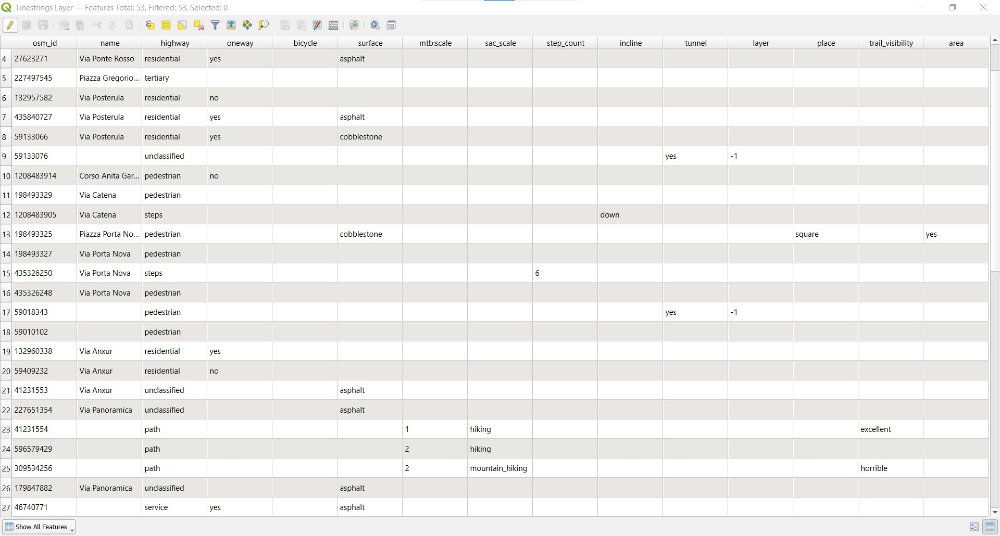

# OSM Map Matching

A [QGIS](https://qgis.org)-plugin for matching a route with the [OpenStreetMap](https://www.openstreetmap.org) road network.

## Dependencies

The plugin uses the following modules: modules networkx, geophy and heapq

## Installation

* Download the file [osm_map_matching.zip](dd)
* From the "Plugin" menu, open "Manage and Install Plugins..."
* Click on "Install from ZIP"
* Select the zip file you just downloaded and press "Install Plugin"

## How to run

### Add a point vector layer to the current QGIS project

You can use a GPS track in any format that is supported by QGIS. Select the item to import, this must be a sequence of Point (see the figure)

### Open the plugin

On the "Plugin" menu, click on "Analyze" under the "OSM map matching" sub-menu. 

Choose a vector layer of points from those loaded in the project, or select a file that contains one.

Set the "Max distance" parameter to specify the maximum allowable distance between an input point and the map element to which it is mapped.

Set the 'Minimum loop size' parameter for the cleaning phase. This parameter defines the minimum length of loops that will be retained in the output path. During this phase, all loops shorter than the specified value are removed from the solution. The output path is scanned multiple times to ensure all short loops are eliminated. This process can be time consuming but can be interrupted by pressing the 'Cancel' button.

Choose a ESRI Shapefile for the output, by default it is a temporary file.

## How to use the output

Upon completion of the algorithm, the new layer containing the output is loaded. This is a vector layer consisting of consecutive lines. Each line represents a segment of the route as a sequence of points, with additional fields detailing the segment's attributes, which are derived from OSM data. 

To better understand what the plugin produces, it is helpful to look at the Attribute Table of the layer. To do this, select the layer, right-click to open the context menu, and choose "Open Attribute Table".

Each row describes a line feature in the vector layer. The column information is sourced from OpenStreetMap. Some rows may contain more information than others, depending on the accuracy of the data from the source. However, the "highway" column is always present; it identifies the type of road, street, or path. These data can be used to analyze or to represent the original track in a more informative way.

### Example: Statistics on the lengths of various types of roads, ways, and paths

To generate statistics on the lengths of different types of roads or paths traversed by a route, start by adding a field to the attribute table that contains the length of each line. Then, use the "Statistics by categories" algorithm integrated into QGIS. The following animation illustrates the process in detail.

